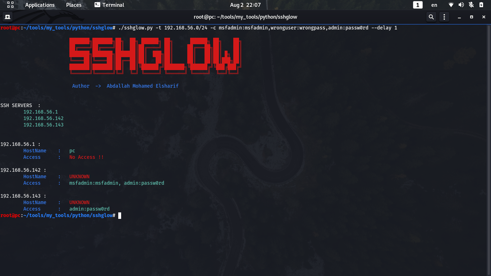
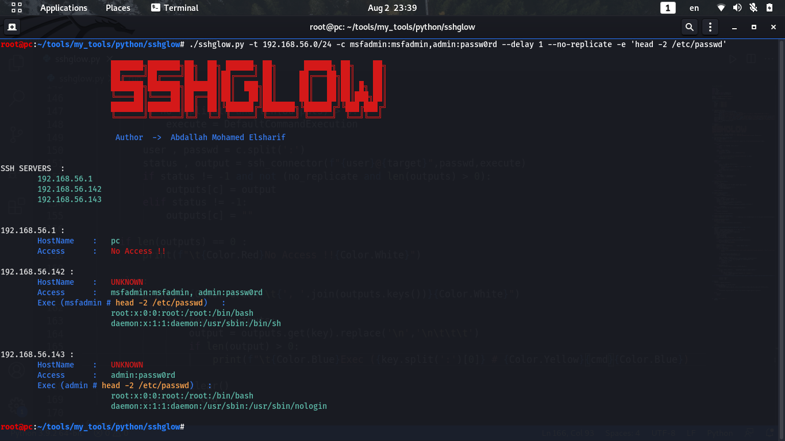

# About
SSHGlow is an enumeration and lateral movement tool in linux environments to find the servers which
we have access on , and execute command on if we want 

# Main Features
- handle cidr or range separated by - or particular targets separated by , or one target
- handle file of credentials or more than account sperated by , or only one account
- SSHGlow uses built-in tools and libraries 

# Enumerate
```
./sshglow.py -t TARGETS -c CREDS
```



# Exec commands
```
./sshglow.py -t TARGETS -c CREDS --no-duplicate -e COMMAND
```



